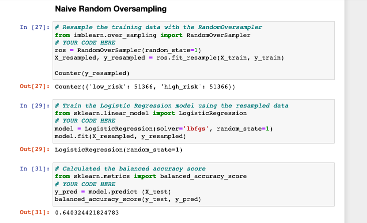
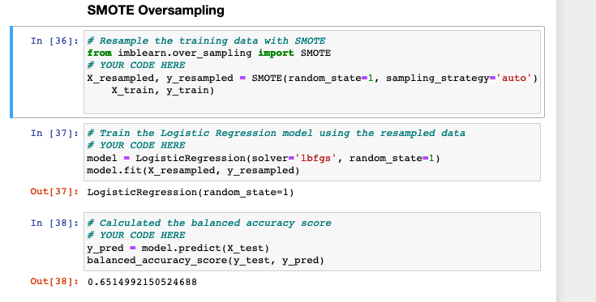
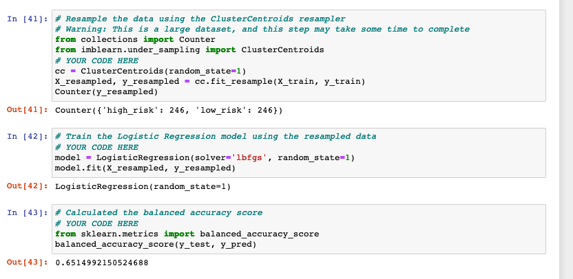
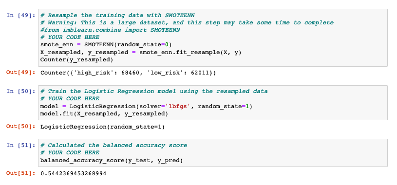
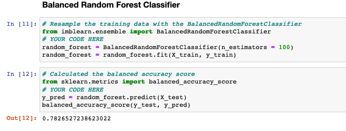
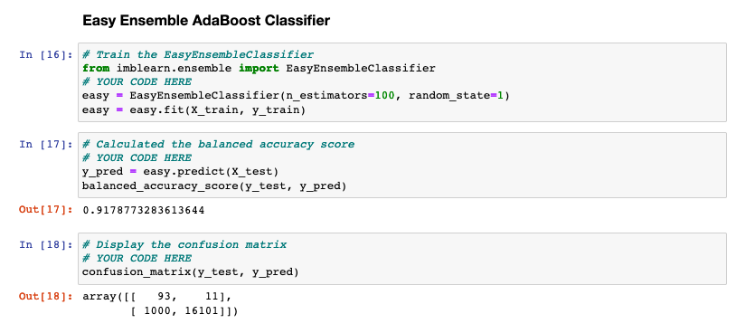

# Credit_Risk_Analysis
## Overview

Using the credit card credit dataset from LendingClub, a peer-to-peer lending services company, you’ll oversample the data using the RandomOverSampler and SMOTE algorithms, and undersample the data using the ClusterCentroids algorithm. Then, you’ll use a combinatorial approach of over- and undersampling using the SMOTEENN algorithm. Next, you’ll compare two new machine learning models that reduce bias, BalancedRandomForestClassifier and EasyEnsembleClassifier, to predict credit risk

## Results
# Balanced accuracy scores (6)

* Naive Random Oversampling accuracy test is 64%. The precision for high risk has a positivity of 1% with a recall of 66%.

* SMOTE Oversampling results accuracy test is 65%. Precision for high risk has a positivity at 1% and recall of 69%.

* Undersamping balanced accuracy score is 65%. Average is 99% and recall is 40%.

* Combination Over & Under balanced accuracy score is 54%. Average is 99% with a recall of 57%.

* Balanced Random Forest accuracy score is 78%. Average is at 99% and recall is 89%.

* Easy Ensemble Adaboost classifier accuracy score is 92%. Average is 99% and recall is 94%.

## Summary

Our first four models, where we undersampled, oversampled, and a combination of both, the accuracy score is not as high as the ensemble classifiers as well as having a lower recall percentage. We are looking for a balance between recall and precision therefore, I would recommend the ensemble classifiers over the other models. Specifically, our easy ensemble shows a high accuracy score as well as a balanced precision and recall scores.

